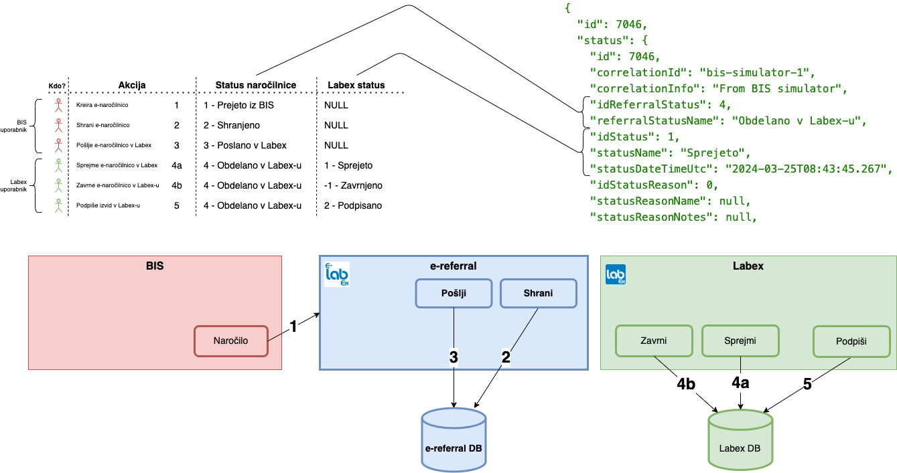

# For BIS providers
## Namen aplikacije
Namen aplikacije je prikazati delujoč primer pošiljanja naročilnice v e-labex.

## Kje najdem primere?
### Podpisovanje zahtevkov
Metode za podpisovanje zahtevkov so implementirane v [/app/api/helpers.js](https://github.com/premisa-si/e-labex-bis-simulator/blob/main/src/app/api/helpers.js#L4).

### Pošiljanje naročilnice
Metode za pošiljanje so implementirane v [/app/api/simulator/send-referral/route.js](https://github.com/premisa-si/e-labex-bis-simulator/blob/main/src/app/api/simulator/send-referral/route.js#L5).

### Pridobitev slike
Metode ze pridobitev slike naročilnice po ID so implementirane v [/app/api/simulator/image-referral/route.js](https://github.com/premisa-si/e-labex-bis-simulator/blob/main/src/app/api/simulator/image-referral/route.js#L5).

### Pridobitev statusa
Metode ze pridobitev statusa naročilnice po ID ali po BIS številki naročilnice so implementirane v [/app/api/simulator/status-referral/route.js](https://github.com/premisa-si/e-labex-bis-simulator/blob/main/src/app/api/simulator/status-referral/route.js#L5).

### Nalepke
Metode za pridobitev podatkov o nalepkah so implementirane v [/app/api/simulator/labels-referral-details/route.js](https://github.com/premisa-si/e-labex-bis-simulator/blob/main/src/app/api/simulator/labels-referral-details/route.js#L5).

### Pridobitev seznama statusov
Metode ze pridobitev seznama naročilnic, ki se jim je spremenil status na določen dan (ali pa so bile na ta dan poslane v Labex), so implementirane v [/app/api/simulator/status-list-referral/route.js](https://github.com/premisa-si/e-labex-bis-simulator/blob/main/src/app/api/simulator/status-list-referral/route.js#L5).

### Pridobitev izvida
Metode ze pridobitev izvidov naročilnice po ID so implementirane v [/app/api/simulator/medical-reports-referral/route.js](https://github.com/premisa-si/e-labex-bis-simulator/blob/main/src/app/api/simulator/medical-reports-referral/route.js#L5).

# Podrobneje o statusu naročilnice
Naročilnica ima dva tipa statusov. Prvi tip je status naročilnice iz vidika avtorja naročilnice. Temu statusu rečemo "Status naročilnice". Drugi tip je status z vidika obdelave naročilnice v laboratoriju. Temu statusu rečemo "Labex status" oziroma samo "Status".

# Podrobneje o izvidih naročilnice
Ena naročilnica pomeni eno naročilo laboratoriju, kjer se ob sprejemu odpre laboratorijska preiskava, za katero nastane izvid.
V laboratoriju se lahko med preiskavo odločijo za dodatne preiskave, ki so povezane z glavno (začetno) preiskavo. Zato poizvedba
po izvidih naročilnice vrača seznam izvidiv. Verjetno bo največ primerov, kjer bo v seznamu samo en izvid.

## Kako vemo, da je izvid pripravljen
Za vsak dan lahko poizvedujete po seznamu naročilnic, katerim se je spremenil status. V primeru izpada ali napake, lahko te poizvedbe izvajate tudi za datume v preteklosti. Poizvedbo na določen dan seveda lahko pošljete večkrat na dan (na primer vsakih 5 minut) in ko v seznamu zaznate naročilnico, ki ima Status = 3 - Podpisan, pošljete poizvedbo za izvid te naročilnice.

## Kako vemo, da je na voljo nova verzija izvida
Pri poizvedbi po izvidih vedno prejmete zadnjo verzijo izvida. V zadnji verziji izvida je vedno vidna vsebina vseh prejšnjih
verzij.
V kolikor se pojavi nova verzija že obstoječega izvida, se naročilnici, na katero je vezan izvid, popravi datum za status. Zato se ta naročilnica ponovno pojavi v seznamu naročilnic, katerim se je spremenil status.

